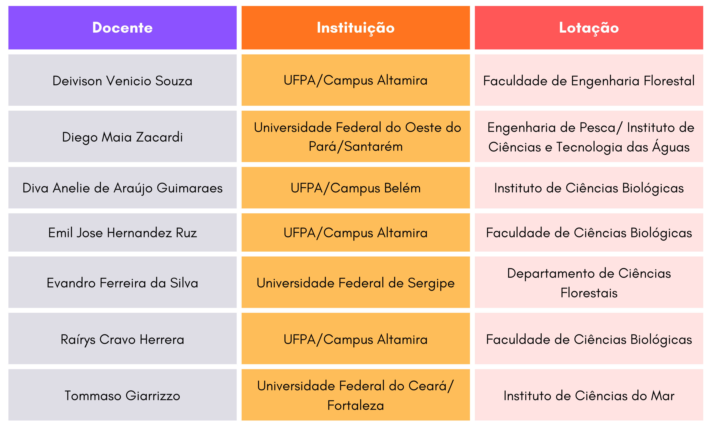
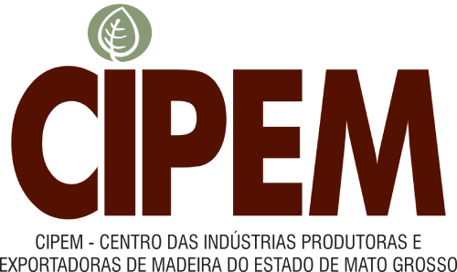
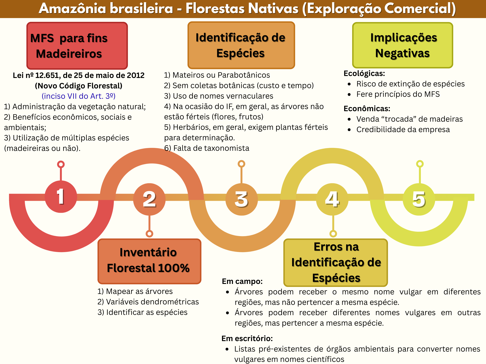
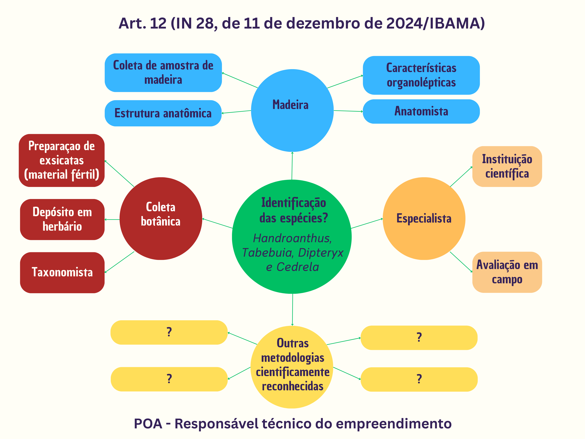
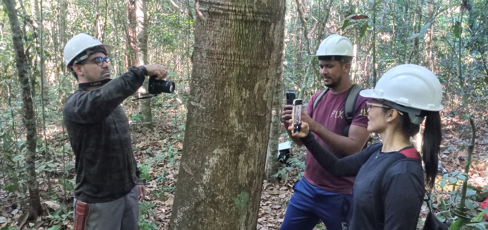
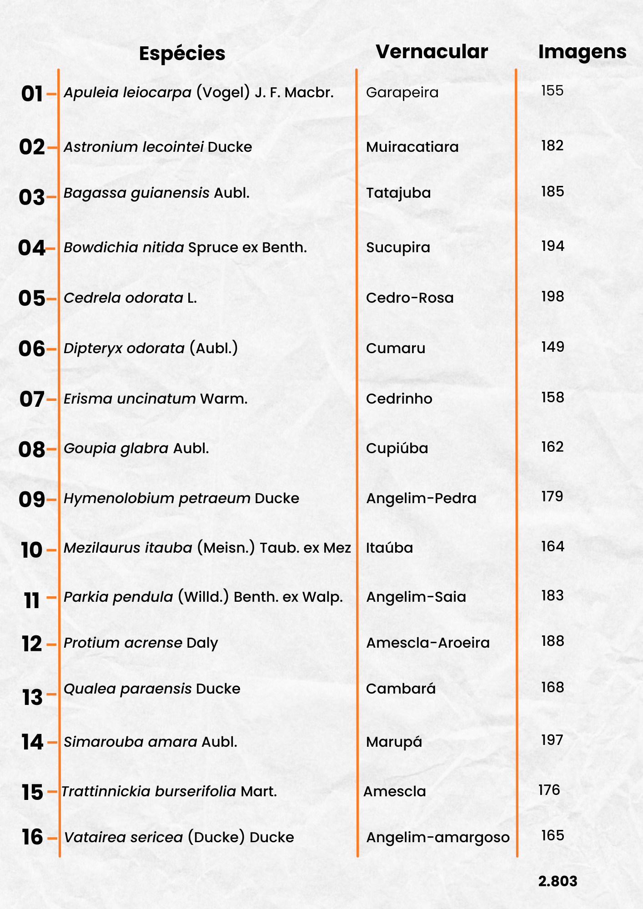
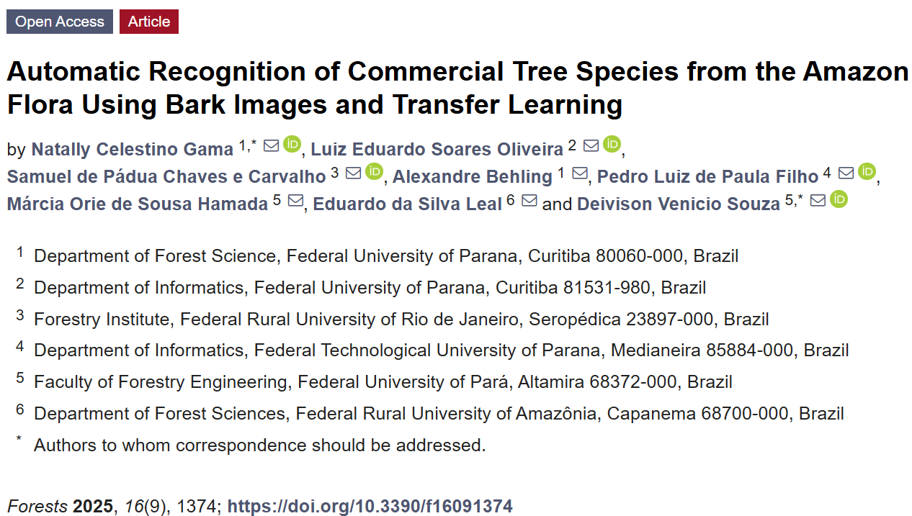
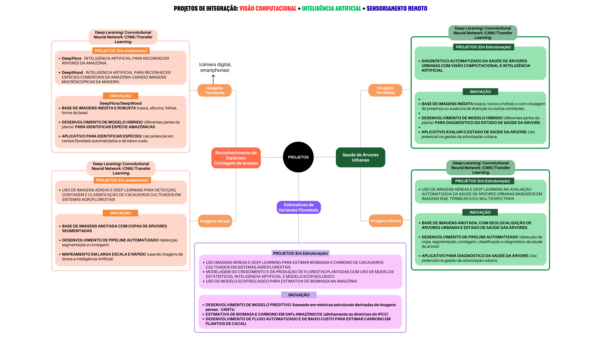

class: title-slide, center, middle
background-image: url(fig/LMFTCA.png), url(fig/ufpa.png), url(fig/PPGBC.png), url(fig/title.jpg)
background-position: 90% 5%, 10% 5%, 50% 35%
background-size: 150px, 130px, 300px, cover
     
```{r setup, include=FALSE}
knitr::opts_chunk$set(
  fig.showtext = TRUE,
  fig.align = "center", 
  fig.show='hold',
  cache = FALSE,
  error = FALSE,
  message = FALSE, 
  warning = FALSE, 
  collapse = TRUE ,
  dpi = 600)
```

```{r icon, echo=FALSE}
#remotes::install_github("mitchelloharawild/icons")
#library(icons)
#download_fontawesome()
#download_simple_icons()
```

```{r packages, include=FALSE}
# remotes::install_github("dill/emoGG")
library(xaringanExtra)
library(ggplot2)
library(dplyr)
library(ggimage)
```

```{r xaringan, echo=FALSE}

use_scribble() # para escrever nos slides
use_share_again()
use_progress_bar()
#use_animate_all(style = c("slide_down"))

use_extra_styles(
  hover_code_line = TRUE,         #<<
  mute_unhighlighted_code = TRUE  #<<
)

xaringanExtra::use_editable(expires = 1)
use_clipboard()
```

<!-- title-slide -->
<br>
##### Universidade Federal do Pará
##### Campus Universitário de Altamira
##### Faculdade de Engenharia Florestal
##### Laboratório de Manejo Florestal, Tecnologias e Comunidades Amazônicas
##### Programa de Pós-Graduação em Biodiversidade e Conservação

<br><br><br>

## Linhas 2 - Conservação e Manejo da Biodiversidade Amazônica

<br>

##### 〰〰〰〰〰〰〰〰〰🌳〰〰〰〰〰〰〰〰〰
##### .font120[**Deivison Venicio Souza**]
##### Professor Associado I - UFPA
##### Coordenador do LMFTCA
##### E-mail: deivisonvs@ufpa.br
##### 👨🏻‍👩🏻‍👦🏻‍👦🏻 [@lmftca_ufpa](https://www.instagram.com/lmftca_ufpa/)
##### 🌎 [https://www.lmftca.com.br/](https://www.lmftca.com.br/)
<br>
##### 1ª versão: 27/fevereiro/2025 <br> (Atualizado em: `r format(Sys.Date(),"%d/%B/%Y")`) <br> Altamira, Pará

---
layout: true
background-image:  url(fig/LMFTCA.png), url(fig/cont.png)
background-position: 99% 94%
background-size: 100px, cover
---
## 🔍 .font70[Linhas 2 - Conservação e Manejo da Biodiversidade Amazônica]

.shadow1[
#### 🔍 **Qual foco da linha?**
]

.shadow2[
 🤔 **Foco**: Estudo das dinâmicas e estratégias para a conservação e o uso sustentável da diversidade biológica.
]

---
## 🔍 .font70[Linhas 2 - Conservação e Manejo da Biodiversidade Amazônica]

.shadow1[
#### 🔍 **Qual foco da linha?**
]

**Aplicações (Exemplos)**: 

.font80[
👉 Estudo da estrutura, composição e funcionamento dos ecossistemas amazônicos;

👉 Estudo das dinâmicas ecológicas (sucessão, interações entre espécies, fluxo gênico) e dos impactos antrópicos (desmatamento, fragmentação, mudanças climáticas);

👉 Diagnóstico das ameaças à biodiversidade, como superexploração de recursos, poluição e espécies invasoras;

👉 Integração do conhecimento científico com o saber tradicional (povos originários e comunidades tradicionais);

👉 Estudo de cadeias produtivas da sociobiodiversidade (açaí, castanha-do-brasil, óleos vegetais (copaíba, andiroba), artesanato em fibras e sementes, outros);

👉 Valoração dos serviços ecossistêmicos e instrumentos econômicos para conservação, como mercados de crédito de carbono; e

👉 Estudos e desenvolvimento de tecnologias inovadoras para manejo e conservação da biodiversidade (Inteligência Artificial).
]

---
layout: true
background-image: url(fig/PPGBC.png), url(fig/LMFTCA.png), url(fig/cont.png)
background-position: 95% 80%, 90% 20%
background-size: 300px, 300px, cover
---

<!-- Slide XX -->
---
class: inverse
layout: false
background-image: url(fig/PPGBC.png), url(fig/sec.png)
background-position: 99% 90%
background-size: 300px, cover

## 👩🏻‍🏫 .font60[**CORPO DOCENTE <br> Linhas 2: Conservação e Manejo da Biodiversidade Amazônica**]
### .font90[*Atuação científica em conservação e manejo sustentável <br> da biodiversidade amazônica*]

---
layout: true
background-image: url(fig/PPGBC.png), url(fig/cont.png)
background-position: 99% 95%
background-size: 200px, cover
---
## 👩🏻‍🏫 Corpo Docente - Linha 2 (CMBA)

```{r , echo=FALSE, fig.show='hold', out.width='80%', fig.align='center'}

```

---
## 👩🏻‍🏫 Corpo Docente - Linha 2 (CMBA)

.pull-left-17[
```{r , echo=FALSE, fig.show='hold', out.width='70%', fig.align='center'}

```
.center[**Diva Anelie de Araújo Guimaraes**]
.center[Instituto de Ciências Biológicas/UFPA/Belém]
]

.pull-left-17[
.shadow1[
.font70[
#### 🎓 **Formação Acadêmica**
- Graduação em Biomedicina - UFPA (1988)
- Mestrado em Zoologia - UFPA (1993) 
- Doutorado em Ciências Biológicas - UFPA (2000)
- Pós-Doutorado em Reprodução Animal - UAB (2008)
]
]
]

--

.pull-left-17[
.shadow1[
.font70[
#### 🔍 **Área(s) de Atuação**
- Manejo e uso de fauna silvestre.
]
]
]

--

.pull-left-17[
.shadow1[
.font70[
#### 📚 **Disciplina(s) no PPGBC**
- XXXXXXXXXXXXXXX
]
]
]

---
## 👩🏻‍🏫 Corpo Docente - Linha 2 (CMBA)


```{r , echo=FALSE, fig.show='hold', out.width='25%', fig.align='center'}

```

---
layout: true
background-image: url(fig/PPGBC.png), url(fig/LMFTCA.png), url(fig/cont.png)
background-position: 95% 80%, 90% 20%
background-size: 300px, 300px, cover
---

<!-- Slide XX -->
---
class: inverse
layout: false
background-image: url(fig/deepflora.png), url(fig/sec.png)
background-position: 99% 90%
background-size: 350px, cover

## .font80[**DeepFlora: <br> Inteligência Artificial para Reconhecer <br> Espécies Madeireiras da Amazônia Brasileira**]
### *(DeepFlora: Artificial Intelligence for Recognising <br> Timber Species in the Brazilian Amazon)*

---
layout: true
background-image: url(fig/deepflora.png), url(fig/cont.png)
background-position: 99% 99%
background-size: 400px, cover
---
## 🖥️Projeto DeepFlora

.shadow1[
#### 🔍 **Projeto de Pesquisa, Desenvolvimento e Inovação Florestal**

👉 **Objetivo**: Desenvolver um **sistema de reconhecimento automático de espécies florestais** de valor comercial madeireiro, usando **imagens digitais de partes de árvores** (cascas externa (ritidoma), alburno e forma da base de troncos, folhas) e técnicas de **aprendizado profundo** (*Deep Learning*), visando a **melhoria da acurácia na identificação de espécies** da flora Amazônica no âmbito **Manejo Florestal Sustentável (MFS) para fins madeireiros**.

]

<br>

.center[
.shadow3[Aplicativo (funcionamento offline) que possa ser usado como **ferramenta auxiliar na identificação de árvores** em censos florestais no âmbito do MFS.
]]


---
## 🏫 Instituições Parceiras e Financiador

.pull-left-11[
.pull-left-11[
```{r ufpa, echo=FALSE, fig.show='hold', out.width='70%', fig.align='center'}
knitr::include_graphics('fig/ufpa.png')
```

]

.pull-right-11[
```{r ufrrj, echo=FALSE, fig.show='hold', out.width='70%', fig.align='center'}
knitr::include_graphics('fig/UFRRJ.png')
```
]

.pull-bottom[
.pull-left-11[
<br><br>
```{r ufpr, echo=FALSE, fig.show='hold', out.width='80%', fig.align='center'}
knitr::include_graphics('fig/UFPR.png')
```
]

.pull-right-11[
```{r ufra, echo=FALSE, fig.show='hold', out.width='70%', fig.align='center'}
knitr::include_graphics('fig/UFRA.png')
```
]
]
]

## .center[💰 Financiador]
.pull-right-11[
```{r cipem, echo=FALSE, fig.show='hold', out.width='50%', fig.align='center'}

```
]

---
layout: true
background-image: url(fig/deepflora.png), url(fig/cont.png)
background-position: 3% 95%
background-size: 400px, cover
---
## 🤔 Motivação

.pull-left-5[
<br><br>
.brand-red[.center[**Por que desenvolver um sistema de reconhecimento automático de espécies da flora?**]]
]

--

.pull-right-5[
```{r, echo=FALSE, out.width='85%', fig.align='center', fig.cap=''}

```
.center[.font80[**Fonte**: O autor (2025).]]
]

---
layout: true
background-image: url(fig/deepflora.png), url(fig/cont.png)
background-position: 3% 95%
background-size: 400px, cover
---
## 🤔 Motivação

.pull-left-5[
<br><br>
.brand-red[.center[**Art. 12.** A identificação das espécies descritas deverá ser realizada no âmbito do POA, utilizando uma das metodologias a seguir:]
]
]

--

.pull-right-5[
```{r, echo=FALSE, out.width='85%', fig.align='center', fig.cap=''}

```
.center[.font80[**Fonte**: O autor (2025)]]
]

---
layout: true
background-image: url(fig/deepflora.png), url(fig/cont.png)
background-position: 99% 99%
background-size: 400px, cover
---
## 🌎 Áreas de Coletas

```{r, echo=FALSE, out.width='58%', fig.align='center', fig.cap=''}
knitr::include_graphics('fig/map.png')
```
.center[.font80[**Fonte**: Gama et al. (2025).]]

---
## Variáveis coletadas

.pull-left-9[
.shadow1[
#### 📝 **Variáveis coletadas**
]

.shadow4[
- Imagens da planta: Casca externa, alburno e forma da base do tronco
- Coordenadas Geográficas
- Diâmetro a 1,30 m do solo
- Altura (clinômetro Haglof)
- Espessura da casca
- Escalada de árvores para coleta de material botânico
]
]

.pull-right-9[
```{r, echo=FALSE, out.width='90%', fig.align='center', fig.cap=''}
knitr::include_graphics('fig/mosaico.png')
```
.center[.font80[**Fonte**: Acervo do autor (2025).]]
]

---
layout: true
background-image: url(fig/deepflora2.png), url(fig/cont.png)
background-position: 100% 50%
background-size: 200px, cover
---
## 🌳 Imagens de Partes da Planta

.pull-left-15[
.pull-left-17[
```{r, echo=FALSE, out.width='75%', fig.align='center', fig.cap=''}
knitr::include_graphics('fig/parkia.png')
```
]

.pull-left-17[
```{r, echo=FALSE, out.width='75%', fig.align='center', fig.cap=''}
knitr::include_graphics('fig/sima.png')
```
]
.center[.font80[**Fonte**: Acervo do autor (2025).]]
]

---
## 🍃 Identificação de Espécies
<br>

```{r, echo=FALSE, out.width='60%', fig.align='center', fig.cap=''}
knitr::include_graphics('fig/bot.png')
```
.center[.font80[**Fonte**: Acervo do autor (2025).]]
<br>

.center[.font80[**Coletas botânicas**: .blue[83 espécimes de 16 espécies (no mínimo 5 árvores por espécie)]]]

---
## 🍃 Identificação de Espécies
<br>

```{r, echo=FALSE, out.width='65%', fig.align='center', fig.cap=''}
knitr::include_graphics('fig/press.png')
```
.center[.font80[**Fonte**: Acervo do autor (2025).]]

.font80[.center[.blue[Exsicatas foram enviadas e incorporadas ao Herbário Felisberto Camargo (HFC) <br> da Universidade Federal Rural da Amazônia....]]]

---
layout: true
background-image: url(fig/deepflora.png), url(fig/cont.png)
background-position: 99% 99%
background-size: 400px, cover
---
## 📷 Amazon Bark Dataset

.pull-left-9[
.shadow1[
#### **Amazon Bark Dataset**
]

.shadow4[
- Denominação: **Amazon Bark** (Cascas Externas)
- Sítios: **3 Áreas de Manejo Florestal**
- Número de imagens: **2.803 imagens**
- Número de Gêneros/Espécies/Família: **16/16/9**
- Número de árvores por espécie: **10**
- Dois dispositivos:

1) **Câmera Canon EOS Rebel** (3024 x 4032 pixels) 

2) **iPhone 11** (4000 x 5328 pixels)

- Distância de captura: 20 cm a 40 cm do tronco
- Altura de captura: 0,30 m a 1,40 m do solo
]
]

.pull-right-9[
<br><br><br>
```{r, echo=FALSE, out.width='100%', fig.align='center', fig.cap=''}

```
.center[.font80[**Fonte**: Acervo do autor (2025).]]
]

---
layout: true
background-image: url(fig/deepflora2.png), url(fig/cont.png)
background-position: 98% 50%
background-size: 200px, cover
---
## 📷 Amazon Bark Dataset

.pull-left-11[
```{r, echo=FALSE, out.width='79%', fig.align='center', fig.cap=''}
knitr::include_graphics('fig/bark.jpg')
```
]

.pull-left-11[
```{r, echo=FALSE, out.width='75%', fig.align='center', fig.cap=''}

```
]

---
layout: true
background-image: url(fig/deepflora2.png), url(fig/cont.png)
background-position: 100% 50%
background-size: 200px, cover
---
## 👩‍🔬 Publicação científica

.pull-left-16[
```{r, echo=FALSE, out.width='80%', fig.align='center', fig.cap=''}

```

.center[.font80[**Acesse aqui**: [Gama et al., 2025](https://doi.org/10.3390/f16091374)]]
]

---
## 🌳 DeepBark - Aplicação Web (Funcionamento)

.center[
<iframe width="760" height="515" src="https://www.youtube.com/embed/a6-HWc7GDJw?si=9zpwC3DdqiFdghzn" title="YouTube video player" frameborder="0" allow="accelerometer; autoplay; clipboard-write; encrypted-media; gyroscope; picture-in-picture; web-share" referrerpolicy="strict-origin-when-cross-origin" allowfullscreen></iframe>
]
.center[.font80[**Fonte**: O autor (2025).]]

---
layout: true
background-image: url(fig/deepflora.png), url(fig/cont.png)
background-position: 3% 95%
background-size: 300px, cover
---
## 🌳 Outras Iniciativas (Em estruturação)

.pull-left-5[
<br><br>
[Outros Projetos (em andamento ou em estruturação)](https://www.canva.com/design/DAG1NCipSs0/L8wc1Zx8n1RpT0XjWGGyJw/view?utm_content=DAG1NCipSs0&utm_campaign=designshare&utm_medium=link2&utm_source=uniquelinks&utlId=h3117df541b)
]

--

.pull-right-12[
```{r, echo=FALSE, out.width='100%', fig.align='center', fig.cap=''}

```
.center[.font80[**Fonte**: O autor (2025).]]
]

<!-- Slide XX -->
---
layout: false
name: etim
class: inverse, middle, center
background-image: url(fig/title.jpg)
background-size: cover

## .font200[Obrigado!]

```{r, echo=FALSE, out.width='20%', fig.align='center', fig.cap='', dpi=600}
knitr::include_graphics('fig/LMFTCA.png')
```

👨🏻‍👩🏻‍👦🏻‍👦🏻 [@lmftca_ufpa](https://www.instagram.com/lmftca_ufpa/)

🌎 [https://www.lmftca.com.br/](https://www.lmftca.com.br/)


