class: title-slide, center, middle
background-image: url(fig/LMFTCA.png), url(fig/ufpa.png), url(fig/PPGBC.png), url(fig/title.jpg)
background-position: 90% 5%, 10% 5%, 50% 35%
background-size: 150px, 130px, 300px, cover
     
```{r setup, include=FALSE}
knitr::opts_chunk$set(
  fig.showtext = TRUE,
  fig.align = "center", 
  fig.show='hold',
  cache = FALSE,
  error = FALSE,
  message = FALSE, 
  warning = FALSE, 
  collapse = TRUE ,
  dpi = 600)
```

```{r icon, echo=FALSE}
#remotes::install_github("mitchelloharawild/icons")
#library(icons)
#download_fontawesome()
#download_simple_icons()
```

```{r packages, include=FALSE}
# remotes::install_github("dill/emoGG")
library(xaringanExtra)
library(ggplot2)
library(dplyr)
library(ggimage)
```

```{r xaringan, echo=FALSE}

use_scribble() # para escrever nos slides
#use_share_again()
use_progress_bar()
#use_animate_all(style = c("slide_down"))

use_extra_styles(
  hover_code_line = TRUE,         #<<
  mute_unhighlighted_code = TRUE  #<<
)

xaringanExtra::use_editable(expires = 1)
use_clipboard()
```

<!-- title-slide -->
<br>
##### Universidade Federal do Pará
##### Campus Universitário de Altamira
##### Faculdade de Engenharia Florestal
##### Laboratório de Manejo Florestal, Tecnologias e Comunidades Amazônicas
##### Programa de Pós-Graduação em Biodiversidade e Conservação

<br><br><br>

## Linha 2 - Conservação e Manejo da Biodiversidade <br> Amazônica (CMBA)

<br>

##### 〰〰〰〰〰〰〰〰〰🌳〰〰〰〰〰〰〰〰〰
##### .font120[**Deivison Venicio Souza**]
##### Professor Associado I - UFPA
##### Coordenador do LMFTCA
##### E-mail: deivisonvs@ufpa.br
##### 👨🏻‍👩🏻‍👦🏻‍👦🏻 [@lmftca_ufpa](https://www.instagram.com/lmftca_ufpa/)
##### 🌎 [https://www.lmftca.com.br/](https://www.lmftca.com.br/)
<br>
##### 1ª versão: 27/fevereiro/2025 <br> (Atualizado em: `r format(Sys.Date(),"%d/%B/%Y")`) <br> Altamira, Pará

---
layout: true
background-image: url(fig/PPGBC.png), url(fig/cont.png)
background-position: 99% 95%
background-size: 200px, cover
---
class: inverse
layout: false
background-image: url(fig/PPGBC.png), url(fig/sec.png)
background-position: 99% 90%
background-size: 300px, cover

## 👩🏻‍🏫 .font60[**PESQUISAS <br> Linha 2: Conservação e Manejo da Biodiversidade <br> Amazônica - CMBA**]

---
layout: true
background-image: url(fig/PPGBC.png), url(fig/cont.png)
background-position: 99% 95%
background-size: 200px, cover
---
## 🔍 .font70[Linha 2 - Conservação e Manejo da Biodiversidade Amazônica - CMBA]

<br>

.pull-left-17[
.shadow1[
#### 🎯 Foco das pesquisas desenvolvidas?
<br>

.center[🤔 .font80[Estudar as dinâmicas e estratégias para a **conservação** e o **uso sustentável** da **diversidade biológica**.]]

<br>

.center[.font90[.blue[*Pesquisas aplicadas à conservação e ao uso sustentável da biodiversidade na Amazônia!*]]]

<br>
.center[🌳🐒🐠🐍]
]
]

.pull-right-17[
```{r , echo=FALSE, fig.show='hold', out.width='50%', fig.align='center'}
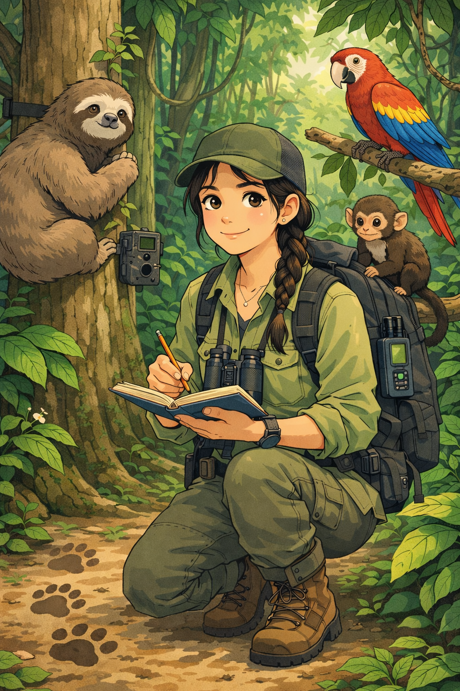
```
.center[.font60[**Fonte**: Gerada por IA (ChatGPT/OpenAI), 2026.]]
]

<!-- Slide XX -->
---
class: inverse
layout: false
background-image: url(fig/PPGBC.png), url(fig/sec.png)
background-position: 99% 90%
background-size: 300px, cover

## 👩🏻‍🏫 .font60[**CORPO DOCENTE <br> Linhas 2: Conservação e Manejo da Biodiversidade Amazônica**]
### .font90[*Atuação científica em conservação e manejo sustentável <br> da biodiversidade amazônica*]

---
layout: true
background-image: url(fig/PPGBC.png), url(fig/cont.png)
background-position: 99% 95%
background-size: 200px, cover
---
## 👩🏻‍🏫 Corpo Docente - Linha 2 (CMBA)

```{r , echo=FALSE, fig.show='hold', out.width='80%', fig.align='center'}
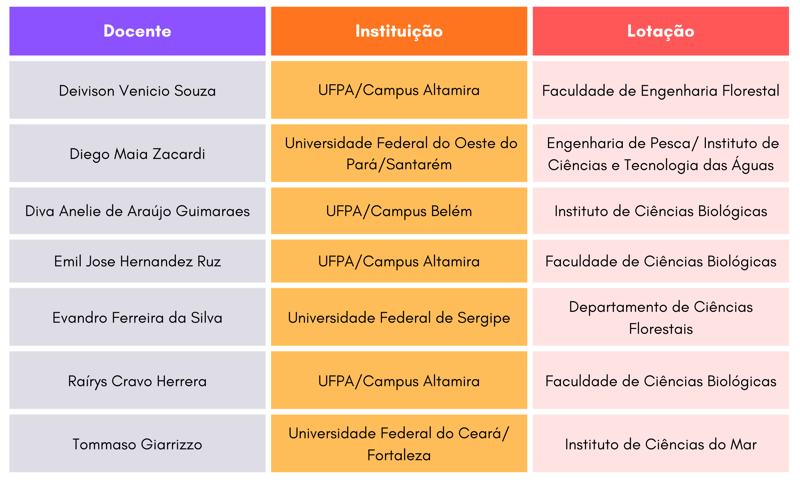
```

---
## 👩🏻‍🏫 Corpo Docente - Linha 2 (CMBA)

.pull-left-17[
```{r , echo=FALSE, fig.show='hold', out.width='70%', fig.align='center'}
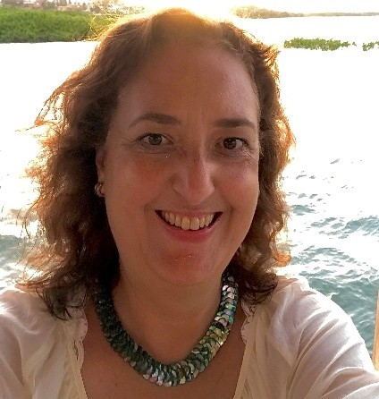
```
.font80[
.center[.blue[**Diva Anelie de Araújo Guimaraes**]]
.center[Instituto de Ciências Biológicas/UFPA/Belém]
.center[[Currículo Lattes](http://lattes.cnpq.br/2891287458034896)]
]
]

.pull-left-17[
.shadow1[
.font70[
#### 🎓 **Formação Acadêmica**
- Graduação em Biomedicina - UFPA (1988)
- Mestrado em Zoologia - UFPA (1993) 
- Doutorado em Ciências Biológicas - UFPA (2000)
- Pós-Doutorado em Reprodução Animal - UAB (2008)
]
]
]

--

.pull-left-17[
.shadow1[
.font70[
#### 🔍 **Área(s) de Atuação**
- Manejo e uso de fauna silvestre
]
]
]

--

.pull-left-17[
.shadow1[
.font70[
#### 📚 **Disciplina(s) no PPGBC**
- Manejo e Uso da Fauna Silvestre (.blue[**45h/3 créditos**])
]
]
]


---
## 👩🏻‍🏫 Corpo Docente - Linha 2 (CMBA)

.pull-left-17[
```{r , echo=FALSE, fig.show='hold', out.width='70%', fig.align='center'}
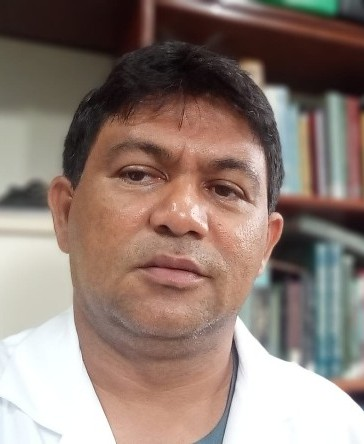
```
.font80[
.center[.blue[**Emil Jose Hernandez Ruz**]]
.center[Faculdade de Ciências Biológicas/UFPA/Altamira]
.center[[Currículo Lattes](http://lattes.cnpq.br/9304799439158425)]
]
]

.pull-left-17[
.shadow1[
.font70[
#### 🎓 **Formação Acadêmica**
- Graduação em Biologia - UNAL (2001)
- Mestrado em Zoologia - UFPA (2004) 
- Doutorado em Genética e Biologia Molecular - UFPA (2010)
]
]
]

--

.pull-left-17[
.shadow1[
.font70[
#### 🔍 **Área(s) de Atuação**
- Herpetologia, diversidade, monitoramento de fauna, restauração e conservação
]
]
]

--

.pull-left-17[
.shadow1[
.font70[
#### 📚 **Disciplina(s) no PPGBC**
- Biologia da Conservação (.blue[**60h/4 créditos**])/(**Disciplina compartilhada**)
- Genética da Conservação (.blue[**45h/3 créditos**])
]
]
]

---
## 👩🏻‍🏫 Corpo Docente - Linha 2 (CMBA)

.pull-left-17[
```{r , echo=FALSE, fig.show='hold', out.width='70%', fig.align='center'}
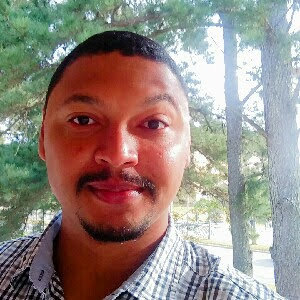
```
.font80[
.center[.blue[**Evandro Ferreira da Silva**]]
.center[Departamento de Ciências Florestais/UFS/São Cristóvão]
.center[[Currículo Lattes](http://lattes.cnpq.br/5248232715871726)]
]
]

.pull-left-17[
.shadow1[
.font70[
#### 🎓 **Formação Acadêmica**
- Graduação em Engenharia Florestal - UFAC (2013)
- Mestrado em Ciências Florestais - UFES (2015)
- Doutorado em Ciências Florestais - UFES (2019)
]
]
]

--

.pull-left-17[
.shadow1[
.font70[
#### 🔍 **Área(s) de Atuação**
- Geoprocessamento, sensoriamento remoto, manejo de recursos florestais e planejamento florestal
]
]
]

--

.pull-left-17[
.shadow1[
.font70[
#### 📚 **Disciplina(s) no PPGBC**
- Metodologia Científica - (.blue[**60h/4 créditos**])/(**Disciplina compartilhada**)
]
]
]

---
## 👩🏻‍🏫 Corpo Docente - Linha 2 (CMBA)

.pull-left-17[
```{r , echo=FALSE, fig.show='hold', out.width='70%', fig.align='center'}
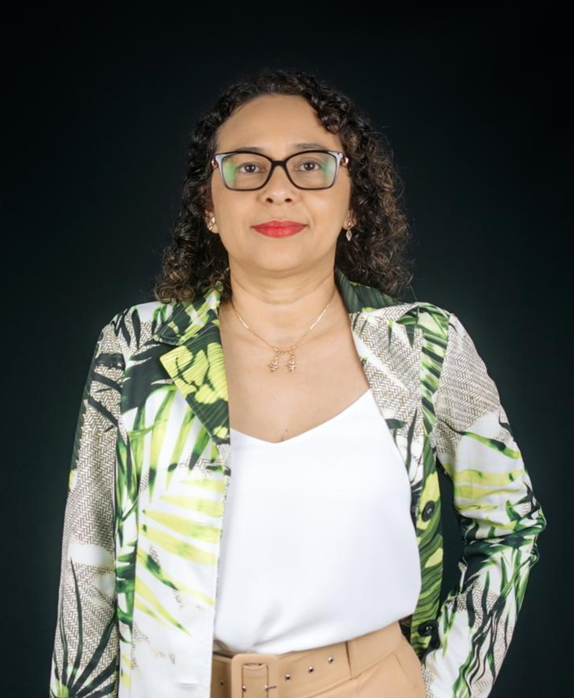
```
.font80[
.center[.blue[**Raírys Cravo Herrera**]]
.center[Faculdade de Ciências Biológicas/UFPA/Altamira]
.center[[Currículo Lattes](http://lattes.cnpq.br/2153779197306503)]
]
]

.pull-left-17[
.shadow1[
.font70[
#### 🎓 **Formação Acadêmica**
- Graduação em Ciências Biológicas - UFPA (2001)
- Mestrado em Agronomia (Fisiologia Vegetal) - UFLA (2003)
- Doutorado em Agronomia (Fisiologia Vegetal) - UFLA (2006)
]
]
]

--

.pull-left-17[
.shadow1[
.font70[
#### 🔍 **Área(s) de Atuação**
- Botânica - Fisiologia vegetal
]
]
]

--

.pull-left-17[
.shadow1[
.font70[
#### 📚 **Disciplina(s) no PPGBC**
- Conservação de Germoplasma Vegetal *In Vitro* - (.blue[**45h/3 créditos**])
- Ecofisiologia Vegetal - (.blue[**45h/3 créditos**])
]
]
]

---
## 👩🏻‍🏫 Corpo Docente - Linha 2 (CMBA)

.pull-left-17[
```{r , echo=FALSE, fig.show='hold', out.width='70%', fig.align='center'}
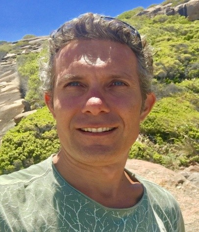
```
.font80[
.center[.blue[**Tommaso Giarrizzo**]]
.center[Instituto de Ciências do Mar/UFC/Fortaleza]
.center[[Currículo Lattes](http://lattes.cnpq.br/5889416127858884)]
]
]

.pull-left-17[
.shadow1[
.font70[
#### 🎓 **Formação Acadêmica**
- Graduação em Scienze Agrarie Tropicali e Subtropiocali - UNIFI (1999)
- Doutorado em Biologia Marinha - UNI BREMEM (2007)
- Pós-Doutorado em Ecologia Aquática e Pesca- CUT (2016)
]
]
]

--

.pull-left-17[
.shadow1[
.font70[
#### 🔍 **Área(s) de Atuação**
- Biodiversidade aquática e avaliação de contaminantes
]
]
]

--

.pull-left-17[
.shadow1[
.font70[
#### 📚 **Disciplina(s) no PPGBC**
- Ecologia e Taxonomia de Comunidades Aquáticas - (.blue[**60h/4 créditos**])/(**Disciplina compartilhada**)
]
]
]

---
## 👩🏻‍🏫 Corpo Docente - Linha 2 (CMBA)

.pull-left-17[
```{r , echo=FALSE, fig.show='hold', out.width='70%', fig.align='center'}
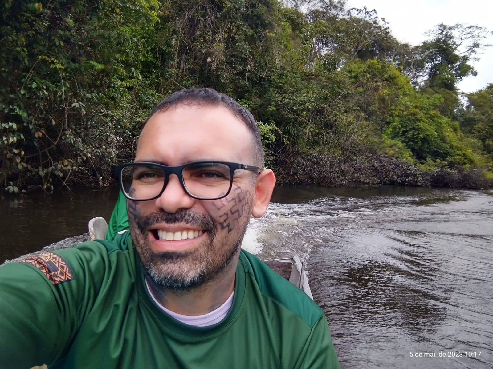
```
.font80[
.center[.blue[**Deivison Venicio Souza**]]
.center[Faculdade de Engenharia Florestal/UFPA/Altamira]
.center[[Currículo Lattes](http://lattes.cnpq.br/9063094443073532)]
<br>
.center[🔍 .font90[.orange[**Laboratório de Manejo Florestal, Tecnologias e Comunidades Amazônicas - LMFTCA**]]]
]
]

.pull-left-17[
.shadow1[
.font70[
#### 🎓 **Formação Acadêmica**
- Graduação em Engenharia Florestal - UFRA (2008)
- Mestrado em Ciências Florestais - UFRA (2011)
- Doutorado em Engenharia Florestal - UFPR (2020)
- Especialização em Big Data e Data Science - UFPR (2019)
]
]
]

--

.pull-left-17[
.shadow1[
.font70[
#### 🔍 **Área(s) de Atuação**
- Manejo e Uso de Produtos da Sociobiodiversidade
- Inteligência Artificial Aplicada
]
]
]

--

.pull-left-17[
.shadow1[
.font70[
#### 📚 **Disciplina(s) no PPGBC**
- Estatística Computacional (.blue[**60h/4 créditos**])
- Inteligência Artificial Aplicada à Biodiversidade (.blue[**45h/3 créditos**])
]
]
]

---
## 🔬 Projetos de Pesquisa - Linha 2 (CMBA)

.pull-left-17[
.shadow1[
.font90[
#### 🎓 **Deivison Venicio Souza**
- DeepFlora - Inteligência Artificial para Reconhecer Árvores na Amazônia (**Coordenador**)
- Papel da floresta amazônica no processo de adaptação e mitigação à mudança climática: ciclagens de água e carbono - ProA (**Integrante/INPA**)
- INCT 3 - Madeiras da Amazônia (**Integrante/INPA**)
]
]
]

.pull-left-17[
```{r , echo=FALSE, fig.show='hold', out.width='80%', fig.align='center'}
knitr::include_graphics('fig/mosaico.png')
```

]

---
## 🌐 Rede(s) Social(is) e Site

<br>

🔍 .font90[.blue[**Laboratório de Manejo Florestal, Tecnologias e Comunidades Amazônicas - LMFTCA**]]

🫱 .font90[**Coordenador**: Deivison Venicio Souza]


.pull-left-17[
```{r , echo=FALSE, fig.show='hold', out.width='90%', fig.align='center'}
knitr::include_graphics('fig/Site.png')
```
.center[.font80[**Acesse o site**: 🌎 [https://www.lmftca.com.br/](https://www.lmftca.com.br/)
]
]
]

.pull-left-17[

```{r , echo=FALSE, fig.show='hold', out.width='90%', fig.align='center'}
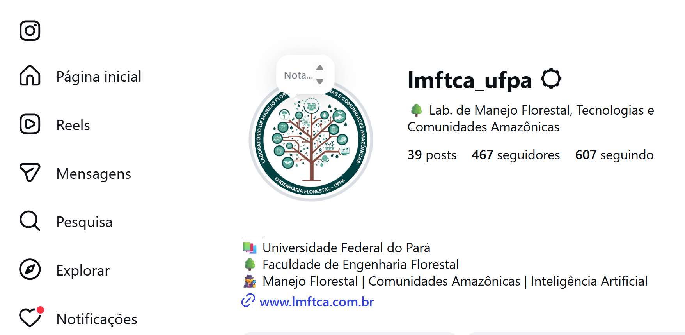
```

.center[.font80[**Instagram**: 👨🏻‍👩🏻‍👦🏻‍👦🏻 [@lmftca_ufpa](https://www.instagram.com/lmftca_ufpa/)
]
]
]

---
layout: true
background-image: url(fig/deepflora2.png), url(fig/cont.png)
background-position: 100% 50%
background-size: 200px, cover
---
## 👩‍🔬 Publicação científica

.pull-left-16[
```{r, echo=FALSE, out.width='80%', fig.align='center', fig.cap=''}
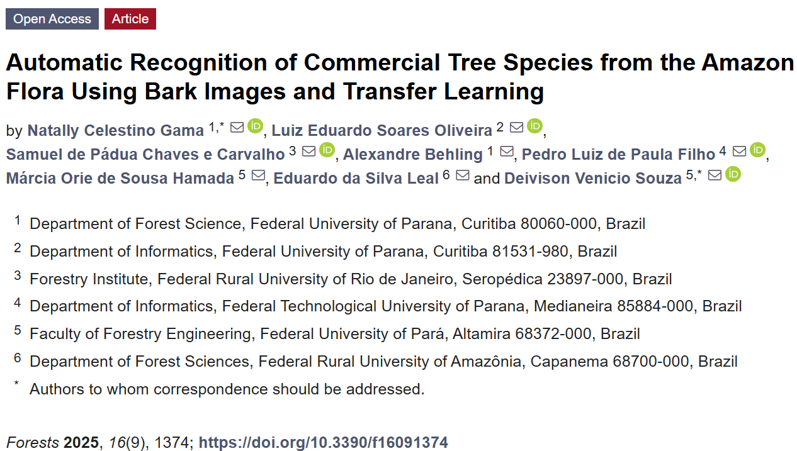
```

.center[.font80[**Acesse aqui**: [Gama et al., 2025](https://doi.org/10.3390/f16091374)]]
]

---
layout: true
background-image: url(fig/deepflora2.png), url(fig/cont.png)
background-position: 98% 50%
background-size: 200px, cover
---
## 📷 Amazon Bark Dataset

.pull-left-11[
```{r, echo=FALSE, out.width='79%', fig.align='center', fig.cap=''}
knitr::include_graphics('fig/bark.jpg')
```
]

.pull-left-11[
```{r, echo=FALSE, out.width='75%', fig.align='center', fig.cap=''}
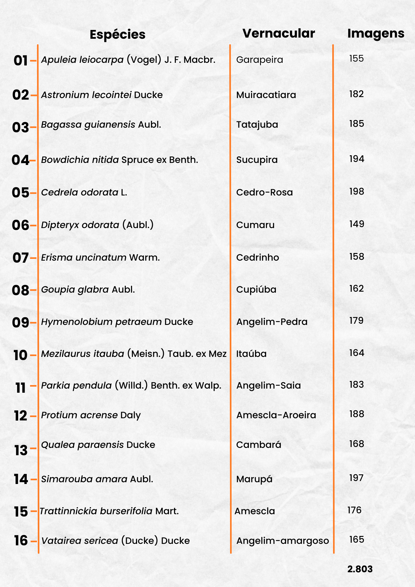
```
]

---
## 🌳 DeepBark - Aplicação Web (Funcionamento)

.center[
<iframe width="760" height="515" src="https://www.youtube.com/embed/a6-HWc7GDJw?si=9zpwC3DdqiFdghzn" title="YouTube video player" frameborder="0" allow="accelerometer; autoplay; clipboard-write; encrypted-media; gyroscope; picture-in-picture; web-share" referrerpolicy="strict-origin-when-cross-origin" allowfullscreen></iframe>
]
.center[.font80[**Fonte**: O autor (2025).]]


<!-- Slide XX -->
---
layout: false
name: etim
class: inverse, middle, center
background-image: url(fig/title.jpg)
background-size: cover

## .font200[Obrigado!]

```{r, echo=FALSE, out.width='20%', fig.align='center', fig.cap='', dpi=600}
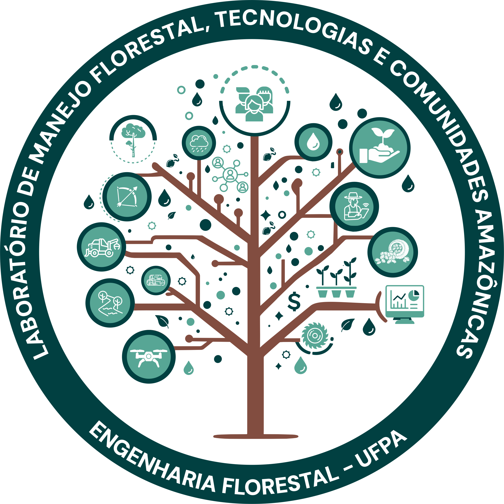
```

👨🏻‍👩🏻‍👦🏻‍👦🏻 [@lmftca_ufpa](https://www.instagram.com/lmftca_ufpa/)

🌎 [https://www.lmftca.com.br/](https://www.lmftca.com.br/)


